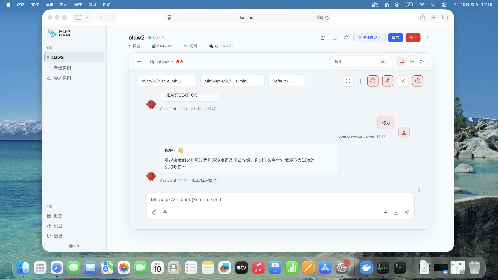
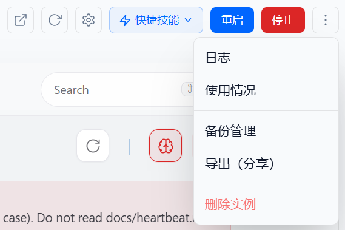
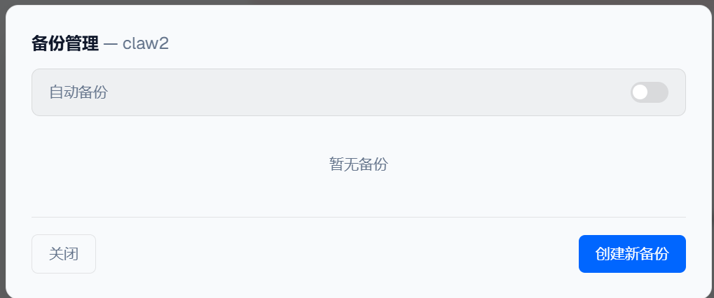

# JishuShell更新日志 | v0.4.10

---

JishuShell v0.4.10 正式发布。本次更新带来完整的 **macOS 支持**和**实例配置备份**功能，同时包含多项稳定性改进。

<div style="text-align: center;"></div>

---

## 新特性

### macOS 全面支持

JishuShell 现在原生支持 macOS（Apple Silicon），与 Linux 使用完全相同的安装命令：

```bash
curl -fsSL https://aijishu.com/install.sh | bash
```

macOS 适配要点：

- **服务管理**：使用 `launchd` plist 替代 `systemd`，服务登录后自动启动
- **容器运行时**：集成 [Colima](https://github.com/abiosoft/colima) 作为 Docker 引擎，安装脚本自动检测并配置，无需手动安装 Docker Desktop

### 实例备份与分享

本次更新带来完整的实例备份体系，与官方 OpenClaw 备份格式双向兼容。

**两种备份范围：**
- **完整备份（默认）**：含配置、升级后的运行时，恢复后无需重跑 `openclaw update`
- **仅数据**：只打包 `.openclaw/` 配置目录，体积更小，格式与官方 CLI 完全一致

**核心能力：**
- **自动备份**：仅在检测到文件变更时执行，按设定份数滚动清理，磁盘不足时自动跳过
- **导出分享**：导出时自动清空 API Key 和 IM 凭证，生成可安全分发的归档包；对方导入后填入自己的凭证即可
- **从备份创建新实例**：本机已有备份或上传外部归档均可一键创建新实例
- **归档校验**：对备份文件执行路径安全、SHA256 校验、结构完整性等 12 项检查

```bash
jishushell backup <id>                          # 完整备份
jishushell backup <id> --state-only             # 仅数据
jishushell restore <id> --latest                # 恢复到最新备份
jishushell restore --new --from <src-id> --latest  # 从备份创建新实例
jishushell export <id>                          # 导出分享包
jishushell import <file.tar.gz>                 # 导入为新实例
jishushell auto-backup <id> enable              # 开启自动备份
```

<div style="text-align: center;"></div>

<div style="text-align: center;"></div>

---

**升级方式：**

```bash
npm install -g jishushell@0.4.10
```

或通过 Dashboard 版本更新横幅一键升级。

---