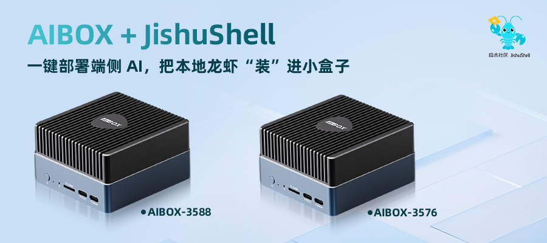
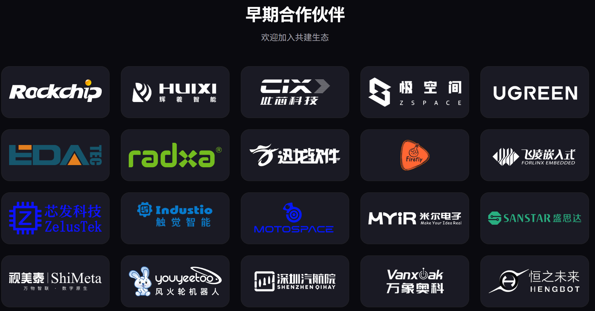
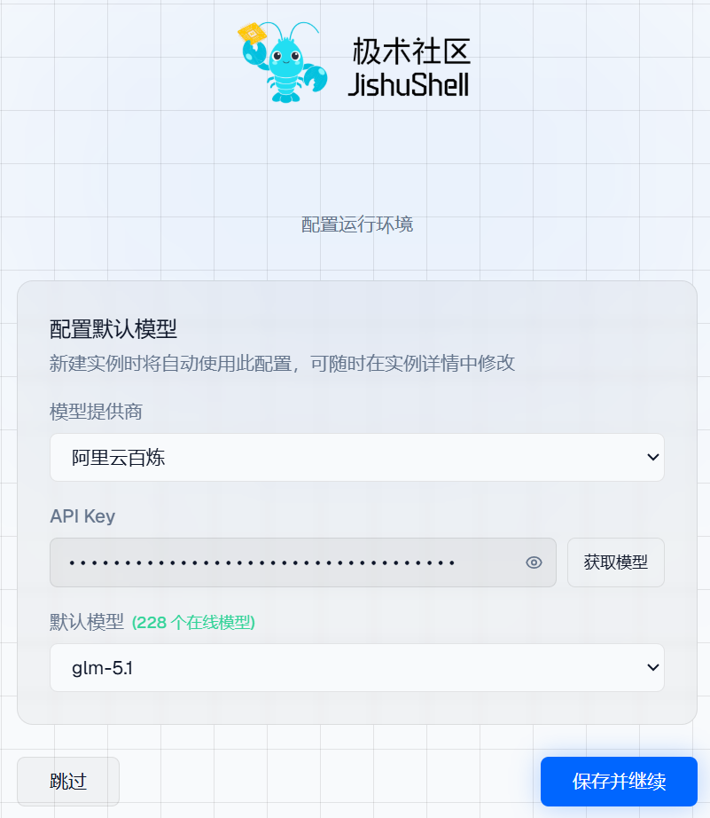
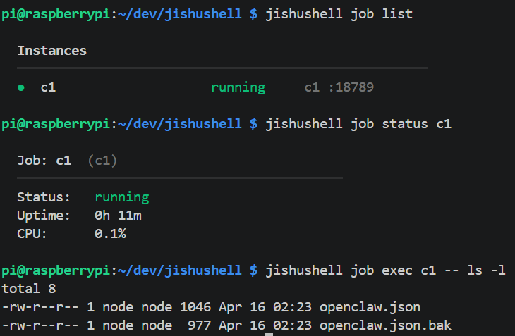
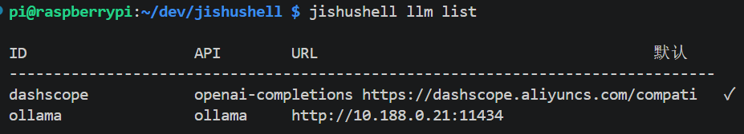
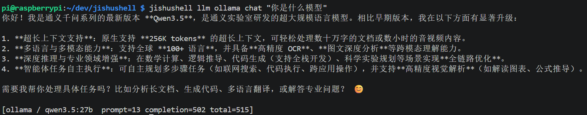
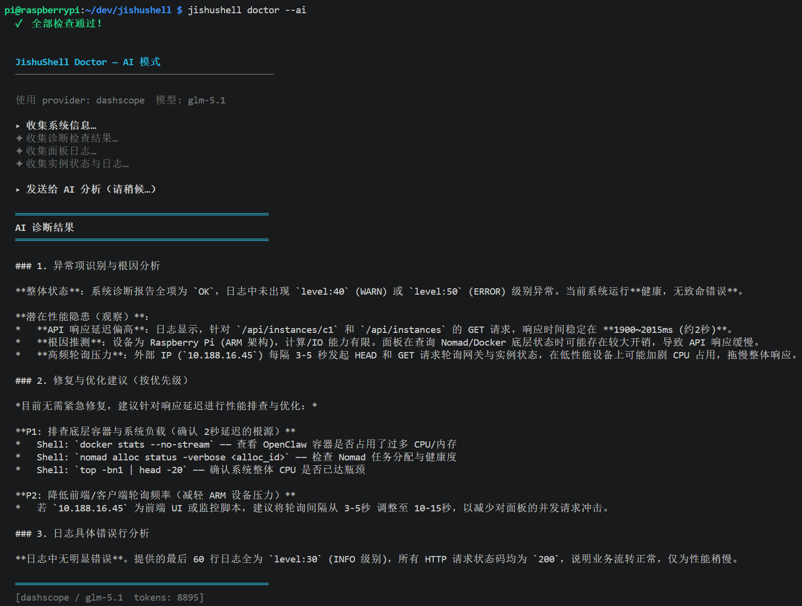

# JishuShell更新日志 | v0.4.17

---

JishuShell v0.4.17 正式发布。本次更新带来**模型列表手动刷新**、**CLI 关键操作**和实验性的 **Doctor AI 诊断模式**，同时包含多项稳定性与性能优化。

---

## 新特性

### 广泛适配多终端：从百元级硬件到端侧大模型布局
全面支持： RK3576、树莓派 4，持续降低使用门槛，适配阵营持续扩容

深度兼容： 此芯 P1、辉羲光至 R1 已完成对接，助力大模型加速下沉端侧

早期合作伙伴陆续支持更多设备

<div style="text-align: center;"></div>

<div style="text-align: center;"></div>


### 模型列表手动刷新

在网页配置页面填入 API Key 后，点击「获取模型」即可立即拉取该供应商当前支持的全部模型列表，无需重启服务。

此前模型列表在安装时写入、不随 API Key 变更而更新。现在只要 API Key 有对应访问权限，刷新后即可看到最新的在线模型，包括供应商新发布的模型。

<div style="text-align: center;"></div>


---

### CLI 能力补充（实验阶段）

关键管理操作现已支持命令行调用，为后续脚本自动化与远程配置打下基础。

**Job 管理:**
```bash
jishushell job list
jishushell job status id
```

<div style="text-align: center;"></div>

**LLM 供应商管理：**

```bash
jishushell llm list                   
jishushell llm ollama chat "你好"      
```

<div style="text-align: center;"></div>

<div style="text-align: center;"></div>

更多 CLI 子命令持续补充中，当前阶段接口尚未稳定，欢迎反馈。

---

### `jishushell doctor --ai` 诊断模式（实验阶段）

配置大模型供应商并填入 API Key 后，可通过 `--ai` 参数启用 AI 辅助诊断。Doctor 会自动收集系统信息、运行检查、面板日志与实例状态，打包后发送给 AI 模型，输出结构化的问题分析与修复建议。

```bash
jishushell doctor --ai
```

<div style="text-align: center;"></div>

AI 诊断结果包含三个部分：

- **异常识别与根因分析**：结合日志和指标判断当前是否存在错误或性能瓶颈
- **修复与优化建议**：按优先级给出可执行的 Shell 命令和配置调整方案
- **日志具体错误行分析**：定位日志中的具体异常条目并给出解读

> **注意**：当前阶段 AI 输出稳定性受模型能力影响，诊断结果仅供参考，请结合实际情况判断后执行建议操作。

---

## 多项稳定性与性能优化

---

**升级方式：**

```bash
npm install -g jishushell@0.4.17
```

或通过 Dashboard 版本更新横幅一键升级。

---