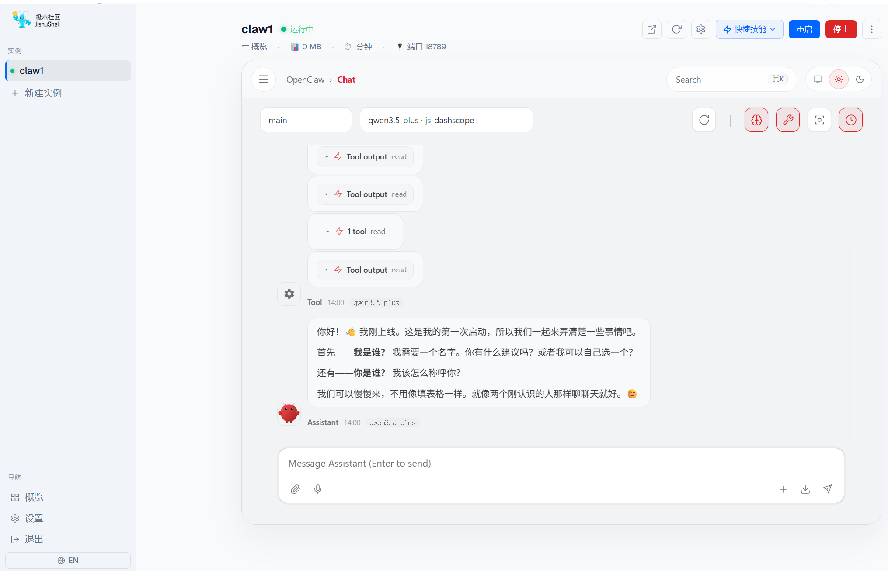
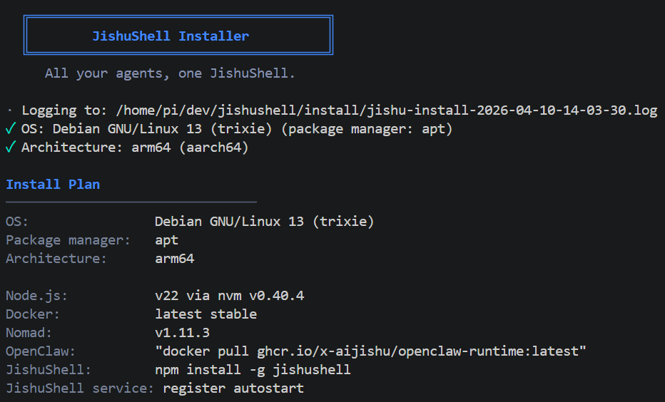
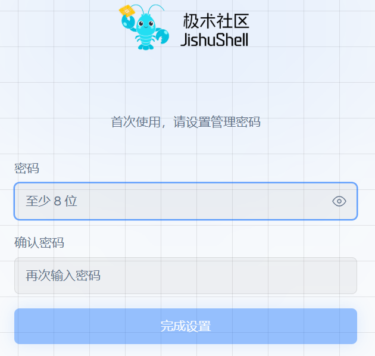
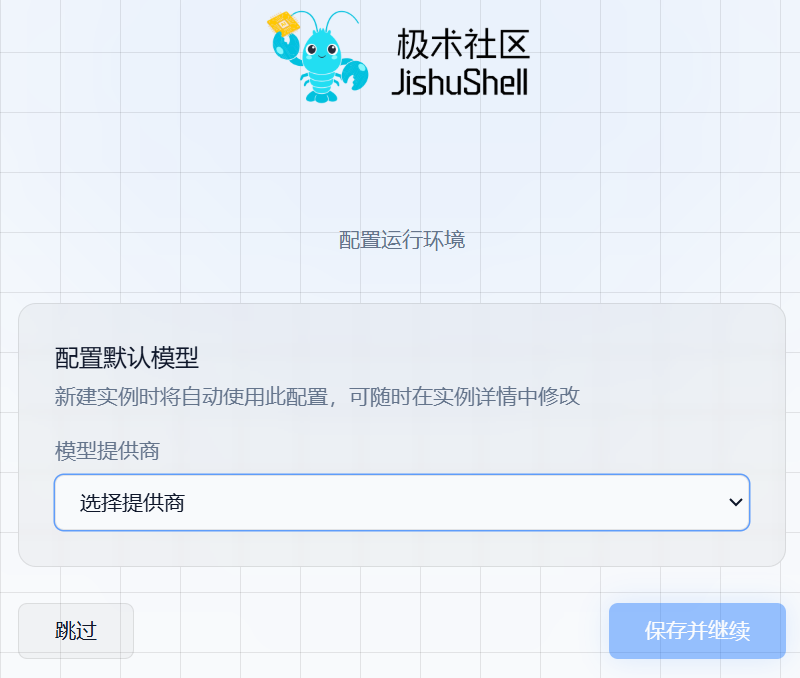
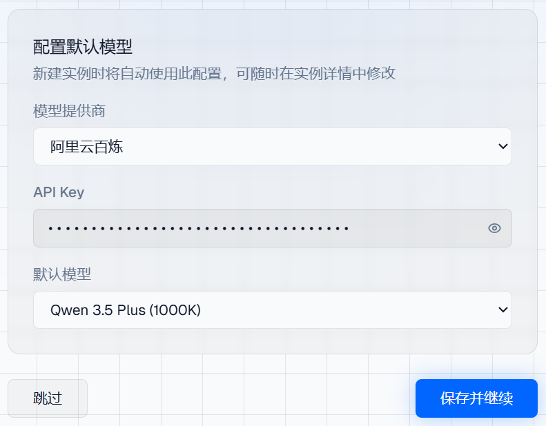
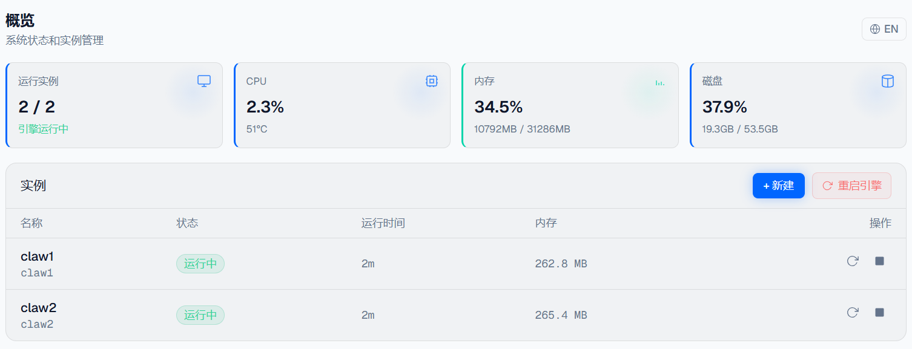
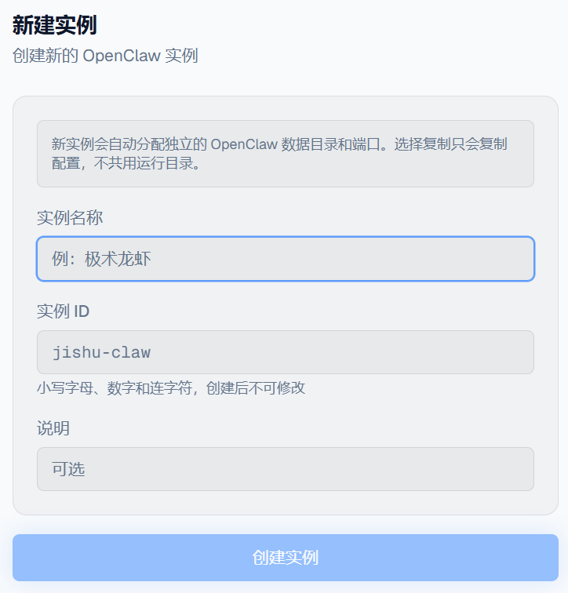
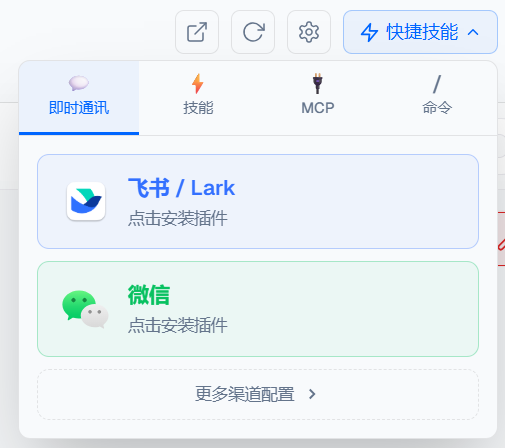
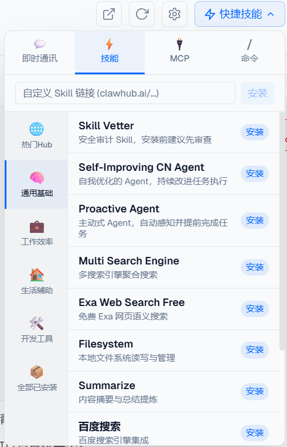

# JishuShell更新日志 | v0.4.2 

---

JishuShell v0.4.2 正式发布——这是 JishuShell 的首个公开版本，带来完整的基础功能：一行命令安装、网页向导配置、多 OpenClaw 实例管理与 Job 调度。

<div style="text-align: center;"></div>
---

## 核心功能

### 一键安装

在 Linux 终端执行一行命令即可完成从零到可用的全部配置：

```bash
curl -fsSL https://aijishu.com/install.sh | bash
```

安装脚本自动处理所有依赖——Node.js（via nvm）、Docker、Nomad 调度引擎——并注册 systemd 服务实现开机自启。安装完成后自动打开浏览器，无需手动操作。

<div style="text-align: center;"></div>

### 网页配置向导（2步）

首次访问 `http://localhost:8090` 进入可视化配置向导，逐步引导完成：

步骤 1:设置管理员密码（bcryptjs 哈希存储）

<div style="text-align: center;"></div>

步骤 2:设置模型提供商

<div style="text-align: center;"></div>

<div style="text-align: center;"></div>

支持的模型提供商包括：OpenAI、Anthropic、Google、DeepSeek、Moonshot、Ollama 及任意兼容 OpenAI API 的自定义端点。

### OpenClaw 多实例管理

单台设备可同时运行多个独立的 OpenClaw 实例，每个实例拥有：

- 独立的 AI 模型配置和 API Key
- 独立的 IM 渠道绑定（飞书、微信各自独立）
- 独立的 Skills 和 MCP 工具集（优化中）
- 独立的对话历史与日志

实例操作（创建、启动、停止、重启、克隆、删除）全部通过 Dashboard 完成，无需命令行。

<div style="text-align: center;"></div>

<div style="text-align: center;"></div>

### IM 渠道接入

实例支持绑定以下即时通讯渠道：

- **飞书 / Lark**：扫码绑定企业机器人，私信即可触发 Agent
- **微信**：个人号扫码，微信私聊驱动 Agent

<div style="text-align: center;"></div>

### Skills 与 MCP 扩展

- **Skills**：可从 [ClawHub](https://clawhub.ai) 安装第三方技能包，通过斜杠命令调用
- **MCP**：通过内置 MCPorter 接入任意 MCP 协议工具

<div style="text-align: center;"></div>

---