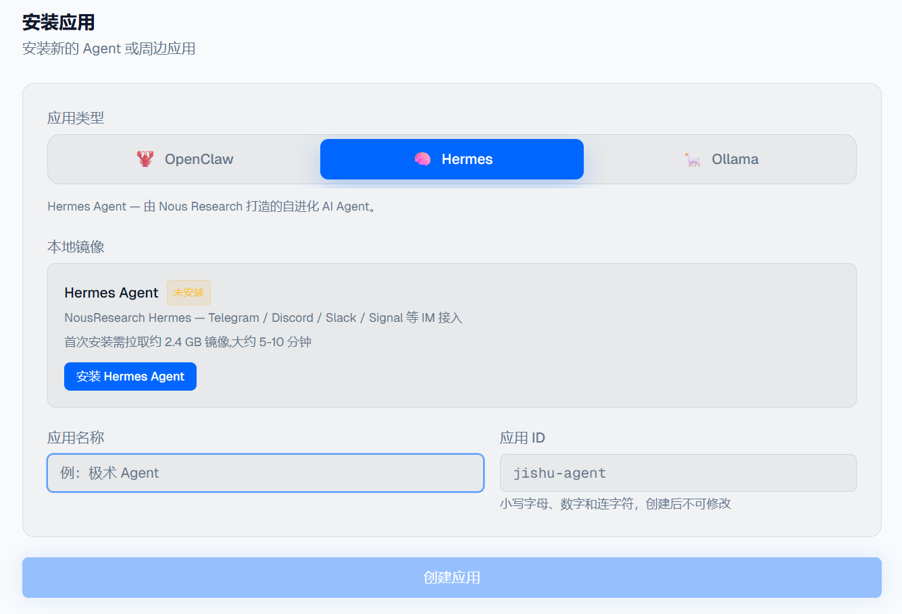
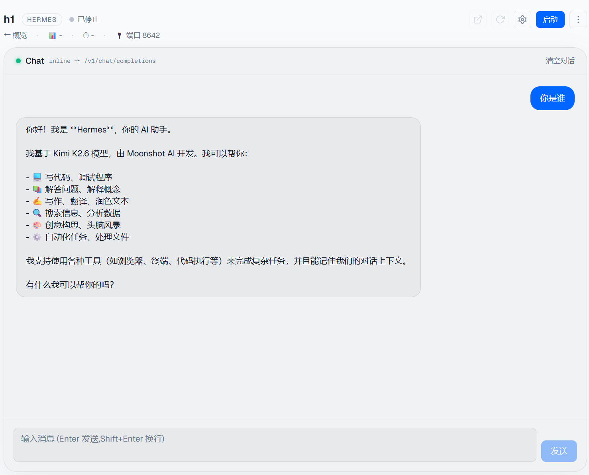
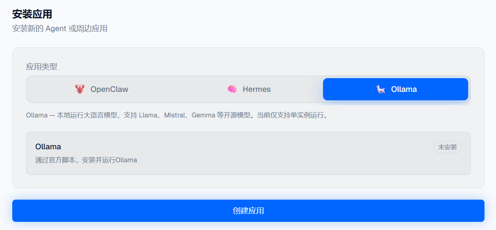
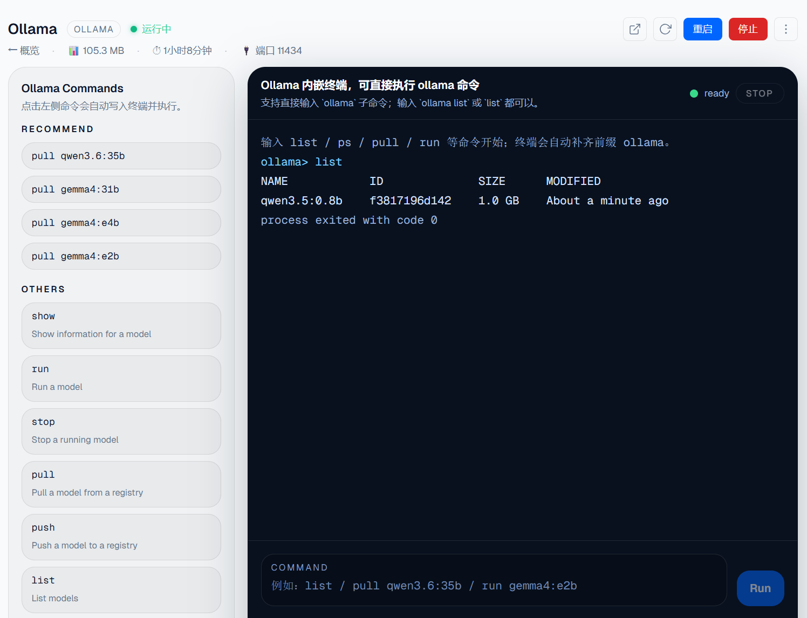
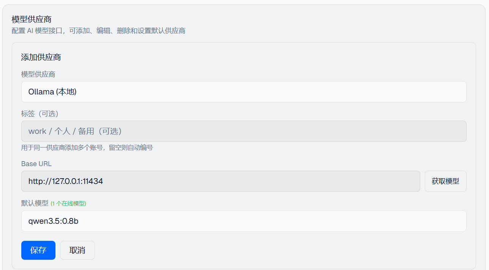

# JishuShell更新日志 | v0.4.24

---

JishuShell v0.4.24 正式发布。本次更新的重点，是把 JishuShell 从单一 Agent 管理面板继续拓展成更通用的 Agent Runtime 与 AI 应用管理平台。现在除了 OpenClaw 之外，Hermes Agent 和 Ollama 也都可以在同一套 Dashboard 中完成安装、启动、管理与使用。

---

## 新特性

### 架构拓展：支持更多 Agent 框架与 AI 应用

这一版继续推进底层架构泛化。JishuShell 不再只面向单一 Agent，而是开始同时承载两类对象：

- **Agent 框架**：例如 Hermes 这类需要实例化、配置并持续运行的 Agent Runtime
- **AI 应用**：例如 Ollama 这类可以独立安装、暴露 API，并提供专用操作的本地服务

统一后的好处是，新增一个框架或 AI 应用时，不需要再单独做一套安装和管理链路，而是可以复用同一套生命周期管理、能力暴露和 Dashboard 展示机制。对用户来说，最终体验就是：更多运行时可以真正做到一键安装，并且在一个面板里统一管理。

这也为后续继续接入更多 Agent Framework、推理服务和 AI 工具应用打下了基础。

---

### Hermes 适配：可一键安装，并提供精简对话页

本次新增了对 **Hermes Agent** 的适配。现在可以直接在 JishuShell 中一键安装 Hermes，并沿用统一的启动、停止、重启和实例管理流程。

<div style="text-align: center;"></div>

Hermes 当前还没有官方 Web 对话界面，因此 JishuShell 为 Hermes 适配了一套**精简的内联对话页**，方便在网页中直接验证模型连通性和基础对话能力，而不必额外依赖第三方前端。

这个精简页面的目标不是替代 Hermes 自己未来可能推出的完整 Web UI，而是先补齐“可直接使用”和“可直接调试”的基本体验：

- **一键接入**：安装完成后即可在 JishuShell 内进入 Hermes 实例
- **快速验证**：可以直接发起对话，检查实例是否工作正常
- **统一体验**：与其他运行时共用同一套实例管理界面，降低切换成本

<div style="text-align: center;"></div>

---

### Ollama 适配（实验阶段）：一键安装与本地模型管理

这一版还加入了 **Ollama** 的实验性适配。现在可以在 JishuShell 中一键安装 Ollama，并把它作为本地模型服务来管理。

<div style="text-align: center;"></div>

围绕 Ollama，目前已经打通了几项核心体验：

- **一键安装**：通过应用安装流程拉起 Ollama，减少手工配置步骤
- **本地模型管理**：支持在实例页集中查看、拉取、运行和清理本地模型
- **本地服务接入**：Ollama 服务可以作为本地推理接口暴露出来，便于后续接给其他 Agent 或 AI 应用使用

为了让常用操作更直接，实例页内提供了针对 Ollama 的快捷命令终端，像 `list`、`ps`、`pull`、`run` 这类高频命令都可以直接执行，用来管理本地模型会比手工切回系统终端更顺手。

<div style="text-align: center;"></div>

同时，JishuShell 也为 Ollama 补上了对应的配置与管理入口，方便查看服务状态、接入信息和后续扩展设置。

<div style="text-align: center;"></div>

> **说明**：Ollama 适配目前仍处于实验阶段，优先解决的是安装、启动、本地模型管理和基础接入能力，后续还会继续补齐更多可视化管理细节与运行体验优化。

---

**升级方式：**

```bash
npm install -g jishushell@0.4.24
```

或通过 Dashboard 顶部的版本更新横幅一键升级。

---